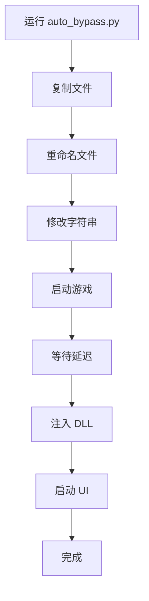
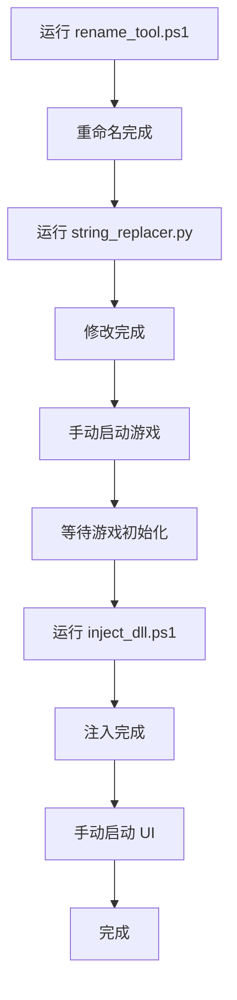

# TinecmaTools 项目结构

## 📁 目录结构

```
C:\Program Files\renderdoc-1.42\
│
├── 📄 README.md                          # 主要说明文档
├── 📄 QUICK_START.md                     # 快速开始指南
├── 📄 CHANGELOG.md                       # 更新日志
├── 📄 PROJECT_STRUCTURE.md               # 本文件
├── 📄 bypass_anticheat_guide.md          # 详细技术文档
│
├── 📂 tools/                             # 工具目录
│   ├── 🐍 auto_bypass.py                 # 自动化绕过工具 (主工具)
│   ├── 📜 rename_tool.ps1                # 文件重命名工具
│   ├── 📜 inject_dll.ps1                 # DLL 注入工具
│   ├── 🐍 string_replacer.py             # 字符串替换工具
│   └── 🔧 hook_process_list.cpp          # 进程隐藏 Hook (源码)
│
└── 📂 assets/                            # 资源文件
    └── 🖼️ screenshots/                    # 截图和演示图片
```

---

## 📄 文件说明

### 核心文档

#### `README.md`
- **用途**: 项目主要说明文档
- **内容**: 
  - 工具列表和功能介绍
  - 快速开始指南
  - 技术原理说明
  - 兼容性列表
  - 故障排除

#### `QUICK_START.md`
- **用途**: 5分钟快速上手指南
- **内容**:
  - 前置要求检查
  - 详细的使用步骤
  - 多个使用场景示例
  - 参数说明表格
  - 常见问题解答

#### `CHANGELOG.md`
- **用途**: 版本更新日志
- **内容**:
  - 版本历史
  - 功能更新记录
  - 已知问题
  - 未来计划

#### `bypass_anticheat_guide.md`
- **用途**: 完整的技术实现文档
- **内容**:
  - 检测机制分析
  - 7种绕过方案详解
  - 代码示例
  - 实战应用

---

## 🛠️ 工具文件

### Python 工具

#### `tools/auto_bypass.py`
- **语言**: Python 3.7+
- **用途**: 自动化绕过工具(推荐使用)
- **功能**:
  - 自动复制并重命名文件
  - 修改二进制特征字符串
  - 启动游戏进程
  - 延迟注入 DLL
  - 启动调试 UI
- **依赖**: 标准库(无需额外安装)
- **执行**: `python tools/auto_bypass.py --renderdoc PATH --game PATH`

#### `tools/string_replacer.py`
- **语言**: Python 3.7+
- **用途**: 二进制字符串替换工具
- **功能**:
  - 查找文件中的特征字符串
  - 批量替换为 TinecmaTools 相关名称
  - 自动备份原文件
- **依赖**: 标准库
- **执行**: `python tools/string_replacer.py FILE_PATH`

### PowerShell 工具

#### `tools/rename_tool.ps1`
- **语言**: PowerShell 5.0+
- **用途**: 批量重命名 RenderDoc 文件
- **功能**:
  - 重命名所有 RenderDoc 相关文件
  - 自动创建备份
  - 支持自定义名称
- **执行**: `.\tools\rename_tool.ps1 -NewName "TinecmaTools"`

#### `tools/inject_dll.ps1`
- **语言**: PowerShell 5.0+
- **用途**: 手动 DLL 注入工具
- **功能**:
  - 查找目标进程
  - 分配远程内存
  - 注入 DLL 文件
  - 支持延迟注入
- **执行**: `.\tools\inject_dll.ps1 -ProcessName "game" -DllPath "PATH"`

### C++ 源码

#### `tools/hook_process_list.cpp`
- **语言**: C++
- **用途**: 进程枚举 API Hook 源码
- **功能**:
  - Hook CreateToolhelp32Snapshot
  - Hook Process32First/Next
  - 隐藏 TinecmaTools 进程
- **编译**: `cl /LD hook_process_list.cpp`
- **注意**: 需要配合 Detours 或 MinHook 库使用

---

## 🔄 工作流程

### 自动化流程 (推荐)



### 手动流程



---

## 📊 文件关系图

```
┌─────────────────────────────────────────────────┐
│              TinecmaTools 系统                   │
└─────────────────────────────────────────────────┘
                        │
        ┌───────────────┼───────────────┐
        │               │               │
    ┌───▼───┐      ┌────▼────┐     ┌───▼────┐
    │ 文档层 │      │ 工具层   │     │ 输出层  │
    └───────┘      └─────────┘     └────────┘
        │               │               │
    ┌───┴───┐      ┌────┴─────┐     ┌───┴────┐
    │README │      │auto_bypass│     │TinecmaTools.dll│
    │QUICK  │      │rename_tool│     │TinecmaTools.exe│
    │GUIDE  │      │inject_dll │     │TinecmaToolsUI.exe│
    └───────┘      └──────────┘     └────────┘
```

---

## 🎯 使用场景映射

### 场景 1: 首次使用
```
需要文件: README.md → QUICK_START.md → auto_bypass.py
```

### 场景 2: 深入了解技术
```
需要文件: bypass_anticheat_guide.md → hook_process_list.cpp
```

### 场景 3: 自定义配置
```
需要文件: string_replacer.py (修改替换规则) → rename_tool.ps1
```

### 场景 4: 故障排除
```
需要文件: README.md (故障排除章节) → QUICK_START.md (常见问题)
```

---

## 📝 文件大小统计

| 文件类型 | 数量 | 总大小 |
|---------|------|--------|
| Markdown 文档 | 5 | ~50 KB |
| Python 脚本 | 2 | ~15 KB |
| PowerShell 脚本 | 2 | ~8 KB |
| C++ 源码 | 1 | ~4 KB |
| **总计** | **10** | **~77 KB** |

---

## 🔐 安全说明

### 敏感文件

以下文件包含系统交互代码,请谨慎修改:

- ⚠️ `inject_dll.ps1` - 进程内存操作
- ⚠️ `hook_process_list.cpp` - API Hook 实现
- ⚠️ `auto_bypass.py` - 自动化系统操作

### 备份机制

以下工具会自动创建备份:

- ✅ `rename_tool.ps1` → 创建 `backup_YYYYMMDD_HHMMSS/` 目录
- ✅ `string_replacer.py` → 创建 `.backup` 文件

---

## 📚 扩展开发

### 添加新工具

1. 在 `tools/` 目录创建新文件
2. 遵循现有命名规范
3. 在 `README.md` 中添加说明
4. 更新本文件的结构说明
5. 在 `CHANGELOG.md` 中记录

### 修改现有工具

1. 创建备份
2. 修改代码
3. 更新相关文档
4. 测试功能
5. 更新 `CHANGELOG.md`

---

## 🔗 文件依赖关系

```
README.md
├── 引用 → QUICK_START.md
├── 引用 → CHANGELOG.md
└── 引用 → bypass_anticheat_guide.md

QUICK_START.md
├── 使用 → tools/auto_bypass.py
├── 使用 → tools/rename_tool.ps1
└── 使用 → tools/inject_dll.ps1

auto_bypass.py
├── 调用 → rename_tool.ps1 (功能)
├── 调用 → string_replacer.py (功能)
└── 调用 → inject_dll.ps1 (功能)
```

---

## ℹ️ 维护说明

### 文档更新优先级

1. 🔴 **高优先级**: README.md, QUICK_START.md
2. 🟡 **中优先级**: CHANGELOG.md, bypass_anticheat_guide.md
3. 🟢 **低优先级**: PROJECT_STRUCTURE.md (本文件)

### 版本发布清单

- [ ] 更新 CHANGELOG.md
- [ ] 更新版本号(如有)
- [ ] 测试所有工具
- [ ] 更新文档中的示例
- [ ] 检查链接有效性

---

**文档生成时间**: 2026-02-08  
**TinecmaTools 版本**: v1.0
