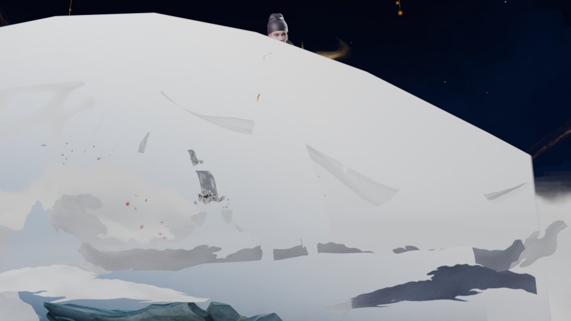

# 王者场景还原 — 李白谪仙

从 `李白谪仙.rdc`（Vulkan 抓帧，121 draws，1920×1080）反解并在 Blender 5.2 LTS 中还原完整场景。



## 成果

| 项目 | 结果 |
|---|---|
| 网格物件 | **76 个**（10 角色部件 + 51 环境/FX 部件 + 15 背景/场景细节），全部带 1-3 套 UV |
| 贴图 | **98 张**，按角色分为 basecolor 23 / normal 9 / mask_packed 57 / lut_ramp 9 |
| 相机 | fovX 50.91° / fovY 29.97°，等效 37.82mm，宽高比 1.7782（≈1920/1080 自检通过） |
| 平行光 | 方向 `(-0.179, 0.175, -0.968)`，取自全部 10 个 1024² 阴影 pass 一致的光矩阵 |
| 成品 | `libai_scene_rebuilt.blend`（双灯光组可切换） |

### 背景扩充（2026-09-16）

在 25 个物件基础上扩到 76 个，新增 51 个 draw：

| 分组 | 数量 | 内容 | 材质 |
|---|---|---|---|
| `05_backdrop` | 3 | 天空穹顶 / 远景背景板（角色之前绘制） | opaque 1 + additive 2 |
| `06_fx_extra` | 4 | 漏导的同族 FX（391/411 飘带、596/619 流萤） | fx-ribbon 2 + fx-card 2 |
| `07_scene_detail` | 44 | 岩石碎屑 / 光点 / 植被贴花等场景细节 | additive 17 + alpha 23 + opaque 4 |

场景细节（07_scene_detail）不是标准 PBR：它们是「贴图 RGB 上色 + 遮罩 alpha」的薄壳/贴花/光点，
按抓帧的混合状态三分流——加性（`src_alpha/one`）走 emission、标准 alpha
（`src_alpha/one-minus-src_alpha`）走透明 BSDF、不透明走 Principled。混合因子由
`probe_blend.py` 从抓帧读取（`GetColorBlends()`，非 `blendState` 属性）。

## 流程

脚本都在 `pipeline/`，除 Blender 侧的两个外均通过
`qTinecmaTool.exe --python <脚本>` 驱动。

| 顺序 | 脚本 | 作用 |
|---|---|---|
| 1 | `scene_survey.py` | 枚举 121 个 draw，按索引数/顶点属性/RT 尺寸分类，挑出 mesh_asset |
| 2 | `probe_matrices.py` | 找 VS 常量缓冲里的仿射矩阵，判定哪个是 model-view（本例 `cb0._child1`） |
| 3 | `probe_verts.py` | 确认原始顶点在物体空间（每网格居中、extent 0.1–4） |
| 4 | `probe_light_cam.py` | 反推相机投影矩阵与太阳方向 |
| 5 | `export_scene.py` | 导出 FBX + PS 绑定贴图（复用 `x64\Development\Plugins\batch_fbx_exporter_ExtraUV` 包） |
| 6 | `probe_blend.py` | 读 `GetColorBlends()` 给场景细节定混合类型（加性/alpha/不透明） |
| 7 | `classify_textures.py` | 自写 PNG 解码器统计 RGB，给贴图定角色 |
| 8 | `export_reference.py` | 导出原始帧作比对基准 + 投影自检 |
| 9 | `blender_rebuild.py` | Blender 内组装（网格/材质/灯光/相机）并渲染预览 |
| 10 | `organize_assets.py` | 整理交付目录 |

`fbx_ascii_import.py` 是第 9 步的依赖；`打开场景_MCP.cmd` 双击可打开带 MCP 的成品场景。

## 三个关键技术判断

### 这是「角色展示帧」，不是大世界场景

用 `cb0._child1` 变换后，7 个主要部件的几何中心**全部重合在 (0,0,106)**；
换用 `_child2` 则散布成球面。这说明它是皮肤预览界面的展示帧，不存在可反推的世界空间。
→ 按原帧展示布局还原。

### 顶点属性必须显式映射

Vulkan/SPIR-V 反射出的属性名是无语义的 `_input0.._inputN`，而本例**全部是 float**。
通用的"float 就是 UV"启发式会把法线误判成 UV。改为按分量数与出现顺序显式映射
（第一个 ≥3 分量 float → POSITION，下一个 3 分量 → NORMAL，4 分量 → TANGENT，剩余 2 分量按序 → UV/UV2/UV3）。

### 坐标系换算的行列式必须为 +1

顶点已烘入相机空间，转 Blender 用：

```
x_b = -x
y_b =  z - 100.061
z_b =  y
```

两个易错点：
- `(x,y,z)->(x,z,y)` 这种纯轴交换 det = −1，是**镜像**，角色左右手会互换——看起来正立但已经错了。靠 `-x` 拉回真旋转。
- RenderDoc 按 Vulkan 原始行序导出图像，所以 `_reference/` 里的参考图**上下颠倒**（脚在上）。它不是还原目标，误当目标会把 Y 再翻一次。

## 加性 FX 的还原：亚像素条带陷阱

25 个 draw 里有 **13 个是加性混合特效**（blend state `src=SRC_ALPHA, dst=ONE`），
它们在 manifest 里没有 basecolor，贴图全被归为 `mask`。若走通用 PBR 分支，
结果是「实心金条」和「实心白团」——这是本次还原里最费时间的一段。

脚本按 eid 分成四类处理（见 `blender_rebuild.py` 顶部的 `FX_*` 常量）：

| 类别 | eid | 图形 | 做法 |
|---|---|---|---|
| `fx-ribbon` | 338/353/365/407/423 | 金色流光带 | vertexColor × noiseRGB → Emission，alpha = mask.a × luma(noise) |
| `fx-ribbon/sub` | 307/322/334/377/389 | 亚像素细丝 | 同上，但 mask.a 换成**沿 v 的积分常量** |
| `fx-card` | 601/719 | 金色流萤 | main × secondary → Emission，alpha = main.a × luma(ramp) |
| `fx-mist` | 429/456/569 | 剑侧金烟 | 常量金色 `(1.0,0.72,0.28)`，贴图只塑形 alpha |

### 为什么需要「积分常量」这个特殊处理

这是整个还原里最反直觉的一处。那 5 个条带在 1920×1080 下的屏幕宽度实测只有
**0.7 像素**（几何 0.22 单位宽 × 15 单位长，屏幕长宽比 9~11）。

遮罩的 alpha 是一条沿 v 的软渐变带（`tex_149779` 峰值 0.463、有效区间 v∈[0.276,0.724]；
`tex_151089` 峰值 0.608、区间 v∈[0.402,0.591]），但整条 v=0→1 的渐变
被压进了不到一个 texel。EEVEE 点采样只能命中其中任意一个值——通常接近峰值，
于是条带渲成一条不透明亮线。而 GPU 原帧看到的是这条渐变的**积分**
（分别只有 0.1009 和 0.0383），所以在捕获里它们几乎不可见。

修法：把点采样的 `mask.a` 直接替换为该积分常量，噪波 luma 仍保留沿长度的变化。

排查时走过的三条弯路，记下来免得重犯：

1. **以为是 UV 方向错了**。顶点级 UV.v 只有 0/1 两个值，误判成"采不到渐变带"，
   于是加 `ShaderNodeMapping` 把 v 重映射到 [0.37, 0.63]。**这是错的**——
   片元级 v 本来就会在条带宽度上插值出完整 0→1，Mapping 反而把软渐变压成了
   接近均匀的峰值，条带更实了。
2. **以为提高分辨率/采样能解决**。`taa_render_samples=128` + 100% 分辨率
   + `filter_size=1.5` 只让金条变淡，没有消除——亚像素几何在 EEVEE 里
   本质上无法正确解析，必须在着色器侧补偿。
3. **忘了 emission strength 会把 alpha 乘回来**。已经把 alpha 压到 0.1 之后，
   金条依然亮，因为 `Emission Strength=3.0`。EEVEE 的 `BLENDED` 表面方法
   把 emission 直接加进帧缓冲，任何 >1.0 的强度都会把刻意压低的 alpha 抵消掉。
   → `FX_EMISSION_STRENGTH` 必须保持 1.0。

另外贴图角色**不能信 manifest 的 slot**，要按实测 alpha 方差判定：
alpha 有变化的是遮罩，alpha 恒为 1.0 的是噪波（`_img_alpha_varies()`）。
`4x4` 尺寸的贴图是引擎占位 dummy，一律跳过。

### eid699 是重复 draw

`eid699` 与 `eid692` 逐字节相同（同为 6657 索引、同 `tex_149993`），
引擎向 `04_bg_board` 又发了一次。两份共面副本同时可见会在腰带处 z-fighting，
脚本将其 `hide_render` + `hide_viewport`，保留不删。

## 已知环境坑

- **renderdoc-cli / renderdoccmd 在 agent 沙箱内必挂**（`0xC0000409`，故障模块 `tsbx.dll`），官方版同样挂 → 只能走 `qTinecmaTool --python`。
- **中文路径读不到 rdc**（ANSI 编码丢字符）→ 先复制到 ASCII 路径。
- **RenderDoc 1.44 用 `st.code != rd.ResultCode.Succeeded`**，旧的 `rd.ReplayStatus` 会 AttributeError 秒退且无输出。
- **Blender 不支持 ASCII FBX 导入** → 用 `fbx_ascii_import.py` 在 Blender 内直接解析（网格出自 GPU 索引缓冲，逐顶点读取无损）。
- **不要从 agent 会话内启动 GUI Blender**，进程会随命令返回被回收 → 用 `.cmd` 双击启动。

## Blender 版本要求：5.2 LTS

**必须用 `E:\blender-5.2.0-windows-x64\blender.exe`** —— BlenderMCP addon 只支持 5.0+，
4.5 装上 addon 也连不上 9876。脚本已同时兼容 4.x / 5.x，但 4.5 下会在日志里打 WARNING。

5.2 相对 4.5 的实测 API 差异（`pipeline/probe_api_52.py` 可复跑验证）：

| 项 | 4.5 | 5.2 | 脚本处理 |
|---|---|---|---|
| 渲染引擎 enum | `BLENDER_EEVEE_NEXT` | **只有 `BLENDER_EEVEE`** | `pick_render_engine()` 按可用项挑 |
| `Material.shadow_method` | 有 | **已移除** | `_set_alpha_cutout()` 改用 `use_transparent_shadow` + `surface_render_method='DITHERED'` |
| `Mesh.use_auto_smooth` | 有 | 已移除 | 未使用，无影响（走自定义法线） |
| `normals_split_custom_set` / `color_attributes` / `uv_layers.new` | OK | OK | 不变 |
| `use_nodes` | OK | OK 但告警将于 6.0 移除 | 暂留，6.0 前需改 |

5.2 重建结果与 4.5 一致：25/25 物件、多套 UV 保留、`hero eid260 forward(y) 5.52..6.27`。

### MCP 桥接（已烘进场景）

addon 的 `register()` **不开端口**——真正的开关是场景属性 `blendermcp_auto_start_server`，
且必须存进 `.blend`。已用 `pipeline/bake_mcp_autostart.py` 烘好，所以现在**双击
`打开场景_MCP.cmd` 打开即通 9876，不用点任何按钮**。

- 算子命名空间是 `bpy.ops.blendermcp.*`（无下划线），`bpy.ops.blender_mcp.*` 不存在
- `pipeline/check_mcp_addon.py` 可复验 addon 在当前 Blender 上能否 enable
  （注意 `--background` 下没有事件循环，端口不会真的监听，headless 验不了连通性）
- MCP 报 `[WinError 10053] Connection to Blender lost` 基本就是 Blender 没在跑

完整可复用流程已存为 skill：`~/.workbuddy/skills/rdc-scene-to-blender/`
